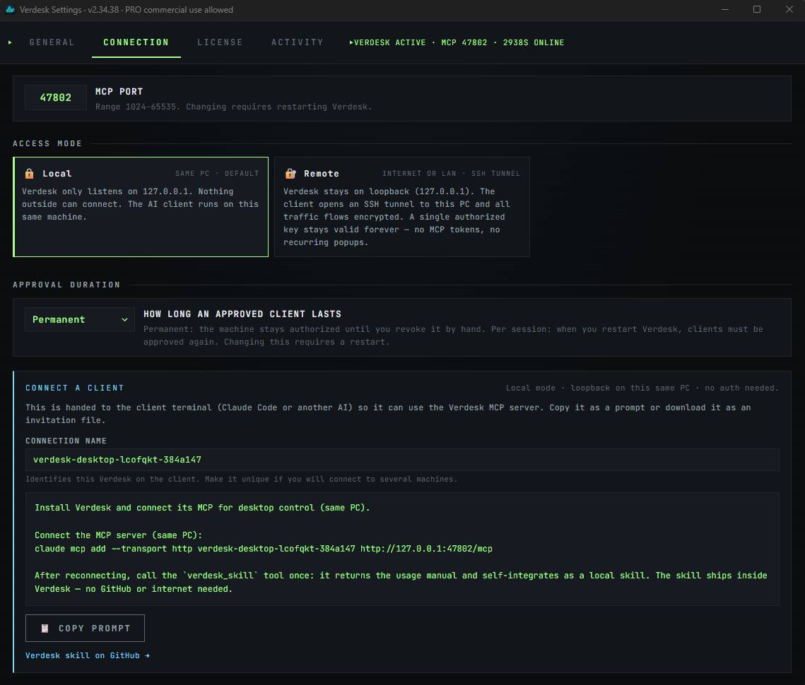

# Verdesk

[](https://www.virustotal.com/gui/file/c86bdb8dfbef34150809ea601affcdb3d2f08b8603958c1f87b21d257ea250b3)
[](https://github.com/chamilonster/verdesk/releases/latest)
[](#install)

**Verdesk is a program for intelligent, efficient control of your desktop — local or remote — by an AI agent**, plus the ability to **record, save and replay automated tasks**. Windows today; **macOS and Linux coming**.

It runs as an **MCP server**: point any MCP‑compatible AI client at it and the agent can **see the screen, click, type, read on‑screen text, run commands, and replay saved routines** — on this PC or a remote one. Instead of mailing a full screenshot every turn, Verdesk feeds the agent **deltas + plain text + UI Automation** — so a typical session uses **≈89–93% fewer vision tokens**, with no loss of control.

→ Landing: **[verdesk.app](https://verdesk.app)** · License: [EULA](./LICENSE) · Skill: [chamilonster/verdesk-skill](https://github.com/chamilonster/verdesk-skill) · **[VirusTotal report (0/72)](https://www.virustotal.com/gui/file/c86bdb8dfbef34150809ea601affcdb3d2f08b8603958c1f87b21d257ea250b3)**

---

## Works with any MCP client

Verdesk is a standard MCP server over HTTP — it makes **no assumption about which model or client drives it**. Compatible with:

**Claude Code** · **OpenCode** · **Claude Desktop** · **Cursor** · **Cline** · **Windsurf** · **Zed** · **Continue** · **VS Code** (GitHub Copilot agent mode) · **Goose** — and **any other client that supports MCP servers**.

---

## What it does

- **See & act on the desktop** — any window, any app, any monitor — **local or remote**.
- **Read on‑screen text without vision tokens** — text comes back as plain strings, ready to reason on.
- **Record / save / replay tasks** — the *action book*: a capable model solves a task once, Verdesk records the exact action chain (with real timing), and a cheaper model replays it later — with **per‑step visual self‑validation** so it never clicks blind.
- **Run commands** (Pro) — drive the shell when clicking would take twenty steps.

---

## How the modulation works

The agent shouldn't pay to re‑see what didn't change, or spend vision tokens to read text a deterministic pass can extract. Verdesk's pipeline:

- **12×8 grid over the viewport** — each turn only the **New / Changed** cells come back (the visual *delta*); unchanged cells are hash references, zero pixels.
- **Perceptual hashing (pHash + dHash)** per cell — dedupe regions, detect change, and remember what was seen before (a live **visual buffer + history** the agent can query).
- **Per‑region refinement** — bump resolution / color / quality only where the agent needs detail; everything else stays cheap.
- **Plain‑text layer** — on‑screen text is read deterministically and returned as strings (no vision tokens for reading).
- **UI Automation** — Verdesk walks the Windows UIA tree (a *DOM for the whole desktop*): when an app exposes it, the agent acts on named controls instead of guessing pixels.

The result is a controllable desktop that costs the AI a fraction of the tokens a "full screenshot every turn" tool would.

---

## The skill

Verdesk ships its own usage manual **inside the binary**, served by the `verdesk_skill` MCP tool — its version always matches the running build, no GitHub or network needed. On first use the agent calls it once: it learns the `look()`‑first workflow, the clicking pattern and the gotchas, and **self‑integrates as a local skill** so future sessions load it automatically.

---

## Install

1. Download the latest **`Verdesk_x.y.z_x64-setup.exe`** from **[Releases](https://github.com/chamilonster/verdesk/releases/latest)** (~197 MB — bundles WebView2 offline, so it works on stripped‑down Windows installs too).
2. Run it. Windows SmartScreen may warn (not code‑signed yet) → **More info** → **Run anyway**.
3. Verdesk lives in your tray. First run opens **Settings**.

Optional (recommended) — verify the download against `SHA256SUMS.txt` on the same Release:

```powershell
Get-FileHash Verdesk_x.y.z_x64-setup.exe -Algorithm SHA256
```

---

## Connect your AI client — just paste the prompt

**No commands to memorize.** After installing, open **Settings → Connection**, choose **Local** (same PC) or **Remote** (over LAN/internet via SSH tunnel — Pro), and hit **Copy prompt**. Verdesk builds the exact connection prompt for you — with a unique name per machine — so you paste it into your agent's terminal and you're done.



The agent connects, calls `verdesk_skill` once to learn the tools, and starts operating the desktop. Tools include `look`, `capture`, `read_text`, `act_uia`, `click_text`, `type_text`, `drag_path`, the action book (`playbook_*`), modulation profiles and more.

---

## Free vs Pro

| | Free | Pro ($49/year) |
|---|:---:|:---:|
| Modulated vision pipeline (deltas, hashing, buffer, history) | ✓ | ✓ |
| All base tools (`look`, `capture`, `read_text`, `act_uia`, profiles, action book…) | ✓ | ✓ |
| Local‑mode MCP server | ✓ | ✓ |
| Remote access (LAN / internet via SSH tunnel or Tailscale) | — | ✓ |
| `run_command` tool | — | ✓ |
| Commercial use | — | ✓ (1 developer · up to 3 devices) |

→ **[Buy Pro](https://verdesk.lemonsqueezy.com/checkout/buy/785996c1-daa0-47e1-a720-4fd1e660e496)** — $49/year subscription. Pay by card, receive a license key by email, paste it in **Settings → License**.

---

## Reporting bugs

Open an issue with: Verdesk version (*Settings → About*), Windows version, mode (Local / Remote) and steps to reproduce.

Security vulnerabilities: see [SECURITY.md](./.github/SECURITY.md).

---

## License

Verdesk is **proprietary; the prebuilt binaries distributed here are free to use under the EULA**. The full terms are in [LICENSE](./LICENSE).

© clever.cat — Camilo Brossard · `camilo.brossard@gmail.com`
